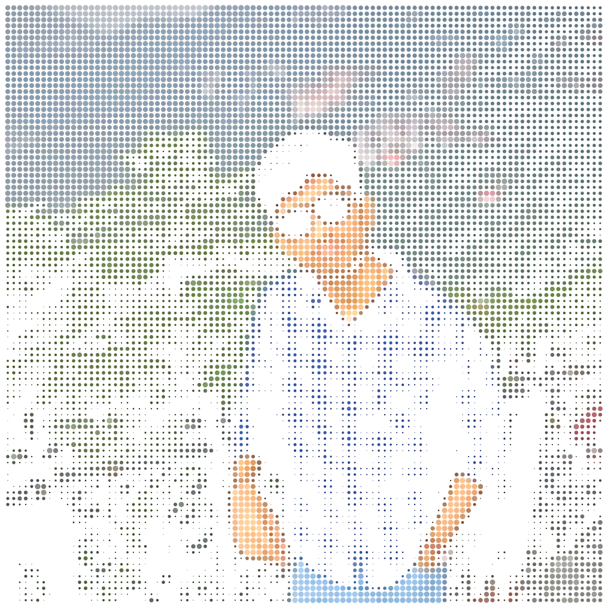
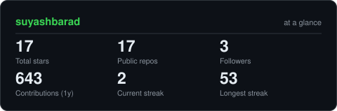
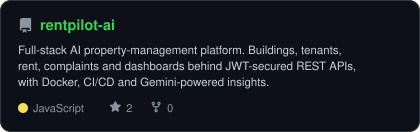
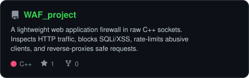
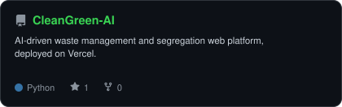
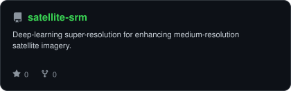
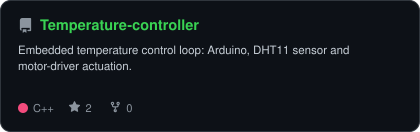
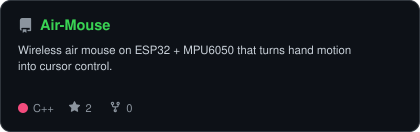

<div align="center">

<!-- PORTRAIT - generated by scripts/dotify.py from assets/jacket.png.
     Colour mode, so one file serves both GitHub themes. Regenerate with:
       python scripts/dotify.py assets/jacket.png -o assets/portrait \
         --cols 100 --equalize --detail 0.5 --color -->


<br>

<!-- NAME / TAGLINE - animated typing -->
<a href="https://github.com/suyashbarad">
  
</a>

<br>

<!-- SOCIALS -->
<a href="https://linkedin.com/in/suyash-barad-796b6534b"></a>
<a href="mailto:baradsuyash4@gmail.com"></a>
<a href="https://github.com/suyashbarad"></a>


</div>

---
<!-- Snake eats the contribution graph - .github/workflows/snake.yml -->
<picture>
  <source media="(prefers-color-scheme: dark)"  srcset="https://raw.githubusercontent.com/suyashbarad/suyashbarad/output/snake-dark.svg">
  <source media="(prefers-color-scheme: light)" srcset="https://raw.githubusercontent.com/suyashbarad/suyashbarad/output/snake.svg">
  
</picture>

</div>

## `~/` Who Am I?

```console
$ cat about.txt
```

Hi, I'm **Suyash Barad**. A Computer Science undergraduate at
**MIT-WPU, Pune** (B.Tech CSE, 2024–2028) who likes shipping things that
actually run — APIs, pipelines, containers, and the occasional ESP32.

- Currently building **[CleanGreen AI](https://github.com/suyashbarad/CleanGreen-AI)** — an AI-powered smart waste management platform

* Built a **full-stack geospatial waste reporting system** with image-based waste analysis, location tracking and an administrative dashboard
* Working with **Python, AI/ML, REST APIs, Leaflet, Gemini, DBSCAN and MCLP** to detect waste, identify hotspots and suggest optimal bin locations
* Interested in **Software Engineering, AI/ML, DevOps and SRE** roles
* Fun fact: **I built a system that turns a simple photo of garbage into a geo-tagged, AI-analyzed waste report with hotspot and bin-placement insights.**

<br>

<div align="center">

## `~/` toolbox


</div>

---

<div align="center">

## `~/` skill radar

<table>
<tr>
<td width="50%" align="center" valign="middle">

<!-- Self-rated radar - edit assets/skills.json, the workflow redraws it -->
<picture>
  <source media="(prefers-color-scheme: dark)"  srcset="assets/radar-dark.svg">
  <source media="(prefers-color-scheme: light)" srcset="assets/radar-light.svg">
  
</picture>

</td>
<td width="50%" align="center" valign="middle">

<!-- Live radar built from real language byte counts across your repos -->
<picture>
  <source media="(prefers-color-scheme: dark)"  srcset="assets/radar-langs-dark.svg">
  <source media="(prefers-color-scheme: light)" srcset="assets/radar-langs-light.svg">
  
</picture>

</td>
</tr>
</table>

</div>

---

<div align="center">


<br><br>

<!-- Snake eats the contribution graph - .github/workflows/snake.yml -->
<picture>
  <source media="(prefers-color-scheme: dark)"  srcset="https://raw.githubusercontent.com/suyashbarad/suyashbarad/output/snake-dark.svg">
  <source media="(prefers-color-scheme: light)" srcset="https://raw.githubusercontent.com/suyashbarad/suyashbarad/output/snake.svg">
  
</picture>

</div>

---

<div align="center">

## `~/` the numbers

<!-- Generated by scripts/cards.py into this repo. Deliberately NOT
     github-readme-stats / streak-stats / github-profile-trophy: those are
     shared public instances that go down and take the whole section with them. -->
<picture>
  <source media="(prefers-color-scheme: dark)"  srcset="assets/card-stats-dark.svg">
  <source media="(prefers-color-scheme: light)" srcset="assets/card-stats-light.svg">
  
</picture>

<br>


</div>

---

<div align="center">

## `~/` selected work

<!-- Cards generated by scripts/cards.py from assets/projects.json.
     Stars, forks and language are pulled live from the API on every run. -->
<table>
<tr>
<td width="50%">
  <a href="https://github.com/suyashbarad/rentpilot-ai">
    <picture>
      <source media="(prefers-color-scheme: dark)"  srcset="assets/card-rentpilot-ai-dark.svg">
      <source media="(prefers-color-scheme: light)" srcset="assets/card-rentpilot-ai-light.svg">
      
    </picture>
  </a>
</td>
<td width="50%">
  <a href="https://github.com/suyashbarad/WAF_project">
    <picture>
      <source media="(prefers-color-scheme: dark)"  srcset="assets/card-WAF_project-dark.svg">
      <source media="(prefers-color-scheme: light)" srcset="assets/card-WAF_project-light.svg">
      
    </picture>
  </a>
</td>
</tr>
<tr>
<td width="50%">
  <a href="https://github.com/suyashbarad/CleanGreen-AI">
    <picture>
      <source media="(prefers-color-scheme: dark)"  srcset="assets/card-CleanGreen-AI-dark.svg">
      <source media="(prefers-color-scheme: light)" srcset="assets/card-CleanGreen-AI-light.svg">
      
    </picture>
  </a>
</td>
<td width="50%">
  <a href="https://github.com/suyashbarad/satellite-srm">
    <picture>
      <source media="(prefers-color-scheme: dark)"  srcset="assets/card-satellite-srm-dark.svg">
      <source media="(prefers-color-scheme: light)" srcset="assets/card-satellite-srm-light.svg">
      
    </picture>
  </a>
</td>
</tr>
<tr>
<td width="50%">
  <a href="https://github.com/suyashbarad/Temperature-controller">
    <picture>
      <source media="(prefers-color-scheme: dark)"  srcset="assets/card-Temperature-controller-dark.svg">
      <source media="(prefers-color-scheme: light)" srcset="assets/card-Temperature-controller-light.svg">
      
    </picture>
  </a>
</td>
<td width="50%">
  <a href="https://github.com/suyashbarad/Air-Mouse">
    <picture>
      <source media="(prefers-color-scheme: dark)"  srcset="assets/card-Air-Mouse-dark.svg">
      <source media="(prefers-color-scheme: light)" srcset="assets/card-Air-Mouse-light.svg">
      
    </picture>
  </a>
</td>
</tr>
</table>

<sub>

| also on the shelf | what it is | stack |
|---|---|---|
| **[ISRO-AQI-Intelligence](https://github.com/suyashbarad/ISRO-AQI-Intelligence)** | Air-quality intelligence on ISRO satellite data | `Python` `AI` |
| **[AI-text-analyzer](https://github.com/suyashbarad/AI-text-analyzer)** | Text analysis powered by NLP | `Python` `NLP` |
| **[warehouse-management-system](https://github.com/suyashbarad/warehouse-management-system)** | Warehouse management web app (Software Engineering project) | `React` `Flask` |
| **[DSA_Daily](https://github.com/suyashbarad/DSA_Daily)** | Multi-day C/C++ data-structures practice log | `C++` `C` |

</sub>

</div>

---

<div align="center">

<sub>`01110100 01101000 01100001 01101110 01101011 01110011 00100000 01100110 01101111 01110010 00100000 01110011 01100011 01110010 01101111 01101100 01101100 01101001 01101110 01100111`</sub>

</div>
